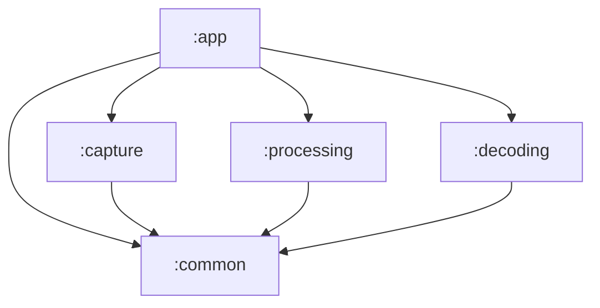

# Arquitectura del Sistema: Lector QR Modular

Este documento detalla la estructura, componentes y flujo de datos del proyecto **Lector**, diseñado bajo una arquitectura modular estricta para Android.

## 1. Estructura General del Proyecto
El proyecto es un **Multi-Module Gradle Project**.
- **Root**: Configuración global (`settings.gradle.kts`, `build.gradle.kts`).
- **Módulos**:
  - `:app` (Android Application)
  - `:common` (Android Library - Interfaces y Modelos)
  - `:capture` (Android Library - Implementación de Cámara)
  - `:processing` (Android Library - Algoritmos de Imagen)
  - `:decoding` (Android Library - Lógica QR)

## 2. Descripción de Módulos y Archivos

### 🟢 Módulo `:common` (Núcleo)
Define el lenguaje común que hablan todos los módulos.
*   **Dependencias**: Exporta `kotlinx-coroutines` para asegurar manejo asíncrono consistente en toda la app.

*   **`src/main/java/com/example/lector/common/`**
    *   **`QrFrame.kt`** (Data Class): Contenedor agnóstico de imagen.
        *   `data`: ByteArray (pixels crudos).
        *   `width`, `height`, `rotationDegrees`: Metadatos geométricos.
        *   `format`: Enum (`Nv21`, `GrayScale`, etc.).
        *   **Validación**: En el `init`, se asegura que `width/height > 0`, `data` no sea vacío y `rotation` sea múltiplo de 90.
    *   **`QrResult.kt`** (Data Class): Resultado final de una lectura.
        *   `rawContent`: String (texto decodificado).
    *   **`ImageCapturer.kt`** (Interface): Contrato para fuentes de imagen.
        *   `startCapture()`: Retorna un `Flow<QrFrame>`.
    *   **`ImageProcessor.kt`** (Interface): Contrato para manipulación de imagen.
        *   `suspend process(QrFrame)`: Retorna un `QrFrame` transformado.
    *   **`QrDecoder.kt`** (Interface): Contrato para interpretación de datos.
        *   `suspend decode(QrFrame)`: Retorna un `QrResult?`.

### 📷 Módulo `:capture` (Entrada)
Implementación concreta de la captura usando **CameraX**.

*   **`src/main/java/com/example/lector/capture/`**
    *   **`CameraXImageCapturer.kt`** (Clase): Implementa `ImageCapturer`.
        *   **Responsabilidad**: Configurar CameraX, manejar el ciclo de vida y convertir `ImageProxy` de Android a `QrFrame` neutral.
        *   **Mejoras Fase 2**: Usa `ResolutionSelector` con estrategia de fallback.
        *   **Concurrencia**: Force el uso del **Hilo Principal (`Dispatchers.Main`)** para el binding/unbinding de CameraX, evitando bloqueos y errores de "Not in application's main thread".
        *   **Funciones clave**:
        *   **Funciones clave**:
            *   `startCapture()`: Gestiona el `Flow` reactivo de frames.
            *   `ImageProxy.toQrFrame()`: Extrae el plano Y (Luminancia) del buffer YUV_420_888 para crear una imagen en escala de grises eficiente.

### ⚙️ Módulo `:processing` (Algoritmos)
Implementación pura de algoritmos de visión artificial.

*   **`src/main/java/com/example/lector/processing/`**
    *   **`OtsuImageProcessor.kt`** (Clase): Implementa `ImageProcessor`.
        *   **Responsabilidad**: Preparar la imagen para el decodificador.
        *   **Funciones clave**:
            *   `process()`: Orquesta la rotación y binarización.
            *   `applyRotation()`: Rota manualmente la matriz de bytes para corregir la orientación del dispositivo (Portrait vs Landscape).
            *   `applyOtsu()`: Calcula el umbral óptimo de contraste y convierte la imagen a blanco/negro (0x00/0xFF).

### 🧩 Módulo `:decoding` (Lógica QR)
Wrapper sobre librería de terceros (ZXing) para la interpretación de códigos.

*   **`src/main/java/com/example/lector/decoding/`**
    *   **`ZXingQrDecoder.kt`** (Clase): Implementa `QrDecoder`.
        *   **Responsabilidad**: Detectar patrones y extraer datos.
        *   **Funciones clave**:
            *   `decode()`: Convierte `QrFrame` a `BinaryBitmap` de ZXing. Usa `Detector` para encontrar los 'Finder Patterns' y `Decoder` para aplicar corrección Reed-Solomon y extraer el texto.

### 📱 Módulo `:app` (Orquestación y UI)
Punto de entrada de la aplicación.

*   **`src/main/java/com/example/lector/`**
    *   **`LectorApplication.kt`** (Application):
        *   **Responsabilidad**: Punto de inicio global.
        *   **Autodiagnóstico**: Configura un `UncaughtExceptionHandler` para capturar crashes no controlados y guardarlos en reportes internos (`app_crash_logs.txt`). Mantiene un log rotativo de ejecución (`app_runtime_logs.txt`) para facilitar el soporte remoto.
    *   **`MainActivity.kt`** (Activity):
        *   **Responsabilidad**: Inyección de dependencias, permisos y pipeline.
        *   **UI Moderno**: ViewBinding (`ActivityMainBinding`).
        *   **Flujo**: Flow de captura -> procesador -> decodificador -> UI.
        *   **UX**: Implementa lógica de **"Debounce"** para evitar spam de notificaciones al detectar el mismo código repetidamente.
        *   **Instrumentación**: Registra eventos clave y errores en el sistema de logs interno.
    *   **`ui/OverlayView.kt`** (View):
        *   Dibuja el marco verde y el oscurecimiento parcial sobre la vista de cámara.
*   **`src/main/res/layout/activity_main.xml`**:
    *   Contiene `PreviewView` (CameraX) y `OverlayView` superpuestos.

## 3. Diagrama de Dependencias

## 4. Flujo de Datos Completo (Pipeline)

El sistema funciona como una tubería reactiva (Kotlin Flows) ejecutada en corrutinas:

1.  **Origen (IO Thread)**:
    *   La cámara captura un frame (ej. 1920x1080 YUV).
    *   `CameraXImageCapturer` extrae solo la luminancia (escala de grises) y reduce/mantiene la resolución (640x480 solicitado).
    *   Se emite un objeto `QrFrame` (ByteArray) al flujo.

2.  **Transformación (Computation Thread)**:
    *   `OtsuImageProcessor` recibe el frame crudo.
    *   **Rotación**: Si el teléfono está vertical, la imagen de la cámara viene rotada 90°. Se reordenan los bytes.
    *   **Binarización**: Se analiza el histograma para separar tinta negra de fondo blanco.
    *   Se emite un nuevo `QrFrame` (ahora binario y rotado).

3.  **Consumo/Decodificación (Computation Thread)**:
    *   `ZXingQrDecoder` recibe el frame binario.
    *   **Detección**: Busca los 3 cuadrados concéntricos (Finder Patterns).
    *   **Corrección**: Si la imagen está dañada, Reed-Solomon reconstruye los datos faltantes.
    *   Se emite un `QrResult` (String) si hay éxito, o se ignora si falla.

4.  **Presentación (Main Thread)**:
    *   Se muestra un `Toast` y un log en consola con el contenido del QR.

## 5. Herramientas de Desarrollo y Diagnóstico

El proyecto incluye facilidades integradas para mantenimiento:

*   **Tarea Gradle `pullLogs`**:
    *   Comando personalizado que extrae automáticamente los logs internos (`crash` y `runtime`) desde el dispositivo conectado a la carpeta del proyecto.
    *   Uso: `./gradlew pullLogs`

## 6. Preparación para Producción

El proyecto está configurado para generar APKs optimizados y seguros mediante las siguientes estrategias:

*   **Ofuscación y Reducción (R8/ProGuard)**:
    *   Habilitado en `release` (`isMinifyEnabled = true`) para ofuscar nombres de clases/métodos y reducir el tamaño del APK.
    *   `isShrinkResources = true` elimina recursos (imágenes, layouts) no utilizados.
*   **Gestión de Reglas**:
    *   Módulos de librería exportan sus propias reglas mediante `consumer-rules.pro`.
    *   La app consume estas reglas y aplica las suyas propias (`proguard-rules.pro`).

